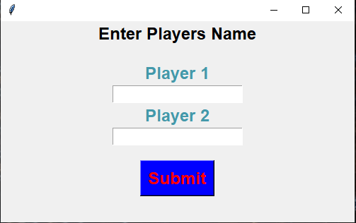
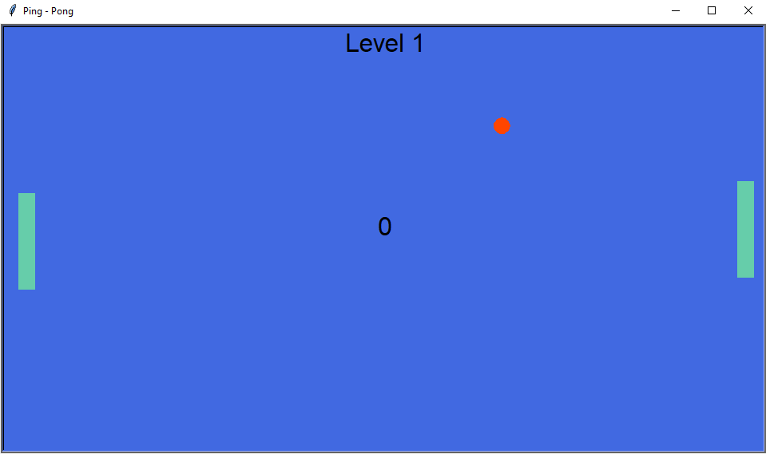

# PyPingPong

A simple Ping-Pong game to pass around time.

## Installation

Simply download the files in a folder and run the ping-pong.py file. The file is compatible with
Python 2.7.x+ and Python 3.6.x+ and with Windows and Linux systems. To run the files use the next
command:

```
python ping-pong.py
```

## Instructions

There is no score limit and the level increases every 5 score points.

- Right player uses Up and Down **Arrow Keys** to move.

- Left player uses W and S to move.

- To pause the game press **ENTER** or __Spacebar__.

- To quit the game press q or Esc.

- To mute the sounds press m.

- To restart the game press r.


## Images from gameplay

<p align="center">   
 
</p>

<p align="center">

</p>
